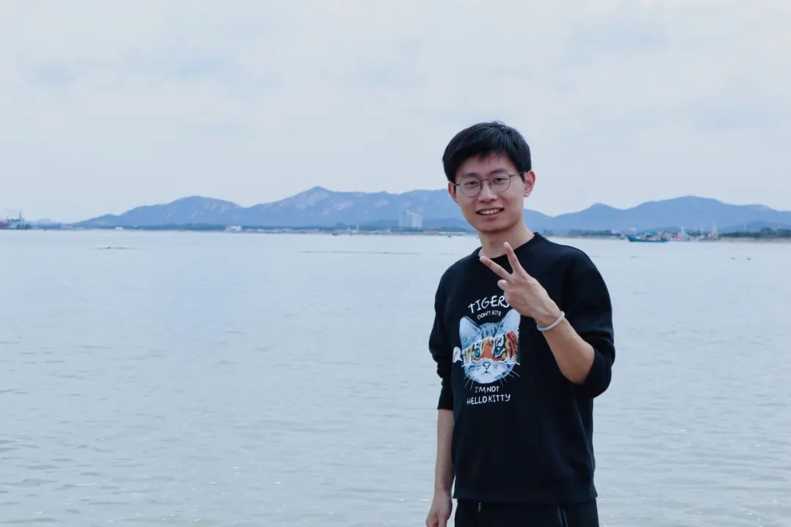
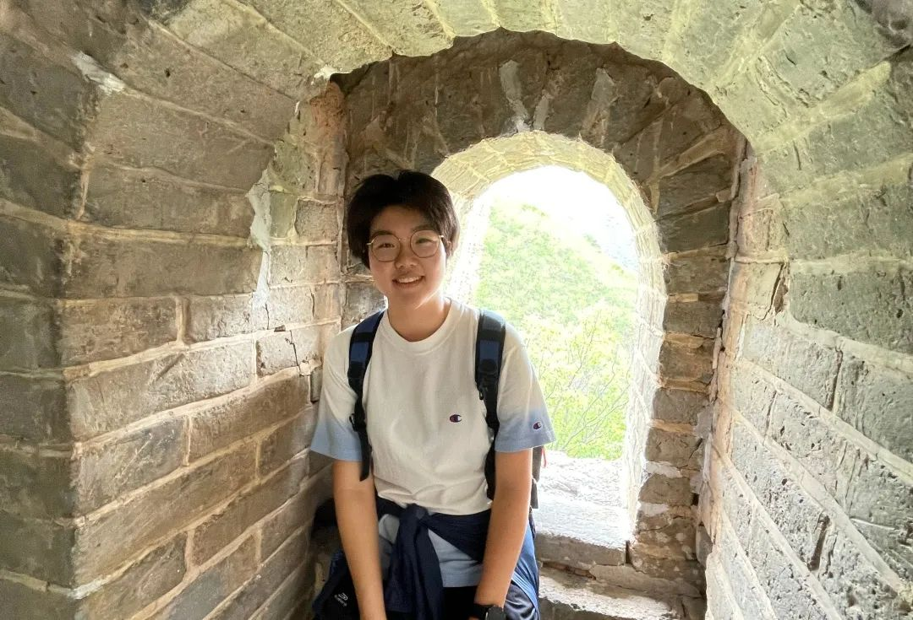
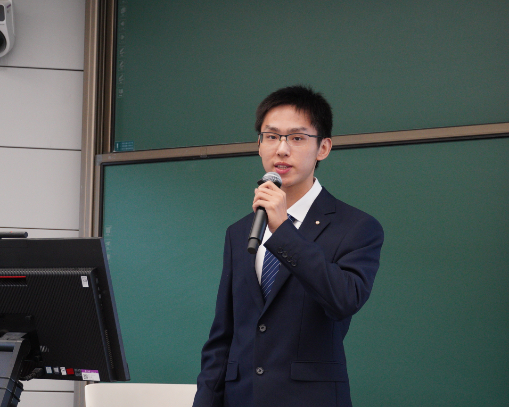
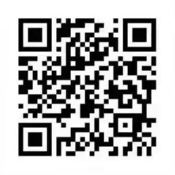

<h1>科创引导会</h1>
⭐ 
<strong>自动化系学生科协</strong>

如果你看到身边的同学接触科研，  
感到焦虑，想要了解科研，明确方向；

如果你是科研小白，  
想要踏足科创但对科研科创不甚了解；

如果你是科研萌新，  
在实验室里不知所措，想要快速入门；

如果你已经具备了一定的科研基础，  
但是遇到了瓶颈不知所措……

**那么请你一定不要错过本次科创引导会！**  
在这里，你可以与科研科创的过来人交流，为你拨开迷雾，了解科研科创；在这里，你可以向优秀的学长学姐请教，引导你入门科研，走上正轨。

<!--truncate-->

系学生科协为大家邀请到了四位重量级嘉宾来分享各自在科研科创经历中的经验与心得。在现场也可以向学长学姐咨询有关学业、科创、科研方面的各种问题。

本次科创引导会将于 **【校历第六周周日（10/29）下午 13:30-15:00】** 在**三教 1103** 举行，有兴趣参加的同学请扫描文末二维码，填写问卷报名~

## 嘉宾介绍

- **罗奕桐**

    

    罗奕桐，自13 班，曾以“智能心脏超声扫描系统”获清华大学第四十一届“挑战杯”三等奖，入选清华大学星火计划十七期，入选自动化系 “ATOM” 计划第九期，入选北京自然科学基金会“启研”资助项目。科研经历丰富，方向包括计算机视觉、人机交互与普适计算、生成式智能体、脑机接口等。主要和大家分享科研路上的故事、科研相关的经验和感悟。

- **史明磊**

    

    史明磊，自15 班，曾作为 SVision 队长带队参加清华大学软件设计大赛并获决赛一等奖，曾作为队长带队参加第二届机器狗开发大赛，曾作为项目负责人完成过一项深度学习相关的 SRT、一项计算机视觉相关的 MetaSRT，入选学推计划。

- **杨馨惟**

    

    杨馨惟，自13 班，曾参加 MetaSRT “指掌交互技术研究及应用探索”项目，曾于通班暑期实践参加自然语言处理和计算机视觉领域相关课题，其中 CV 课题“场景可供性探索项目”荣获暑期优秀课题荣誉，主要向大家分享科研心路历程和如何让自己“准备好”科研。

- **汪润**

    

    汪润，自01 班，曾以“基于深度学习的用于生物显微图像超分辨的光学像差估计”项目参加 ATOM 八期，曾合作参加“异形机器人的创意、设计和制作” SRT 项目并获优秀项目一等奖，曾参加芯动计划、电子设计大赛并最高获得二等奖，现在与未来的研究方向是 RL-based Robot Control。主要向大家分享科研入门经验和学术心路历程。

看完了这些嘉宾的经历和成果，大家是不是非常期待和学长学姐近距离交流了呢？不要犹豫，赶快报名参加吧！我们在这里等待你的到来！

在走上科创旅途之前，不妨先了解一下我校和我系的一些重要的科创活动~

## 科创活动简介

### 星火计划

**“科技创新，星火燎原”**，星火计划是一项通过整合校内外各种相关资源，以培养中国新一代的有代表性的拔尖创新人才为目标的学术科研人才培训计划。

**“星火班”** 学员从本科大二学生中进行选拔。学员自报项目，在项目实践中获得学术科研上的锻炼。学员可以获得专业导师指点，并有机会参加国际学术前沿讲座、培训实践、科研训练以及重大科技创新赛事，还可赴海外一流大学或研究机构开展相关学术交流。

星火班覆盖全部本科专业。在两年的培养期内，学科背景不同、研究方向相似的学员被分为信息技术、能源环境、先进制造、生命科学、人文社科等小组，定期进行学术讨论。不同学科的研究思路与方法得以碰撞。小组成员也可以组成跨学科团队开展自主立项研究。

至今，星火计划已经培养了无数的科技、创新人才，有科创梦的你一定不要错过。

### 学推计划

**清华大学“大学生学术研究推进计划”**（“学推计划”）是校团委、科研院于 2014 年联合发起实施的本科生学术支持计划，是清华大学学生拔尖创新人才 **“全过程累进支持、全方面匹配资源”** 培养体系的重要组成部分。

近年来大学生学术研究推进计划继续加大对本科生科研支持力度，面向全校非毕业年级本科生开放申请。学推计划要求学生根据自身兴趣，自主确定研究方向与课题，联系指导教师确定研究计划。本计划支持项目类型分为院系项目和个人项目，支持周期一般以自然年为周期，学校匹配项目经费，通过项目管理体系以及学术交流平台培育扎实的科研功底和学术创新能力。

大学生学术研究推进计划鼓励跨专业、跨学科的交叉研究项目，支持申请人关注国家战略需求和科研重点难点问题，不断探索前沿科技领域，持续关切社会民生重大问题。

### ATOM 计划

ATOM 计划即 **“自动化系英才计划”**，为自动化系本科生的科技拔尖创新人才提供培养方案，面向系内大二至大三的优秀同学。该项目的目标是提升自动化系本科生的科研能力和学术水平，积极探索基于第二课堂的拔尖创新人才培养路径。

面向大二年级学生选拔，初步选出 20 人左右进行项目考查。通过一学期的考查后正式选出 10 名同学入围培养方案进行培养。项目在进行过程中会进行动态调整，并具有一定的淘汰机制。

ATOM 学员会有相应的课程（以研讨性的讲座为主）匹配。讲座会邀请信息学院内各个方向的老师介绍其研究领域的前沿方向。ATOM 计划还会邀请一些学术界和产业界的精英来为同学们开展小班范围内的讲座。

### SRT 计划

SRT 是 **Student Research Training** 的简称，即**大学生研究训练计划**，是针对在校本科生开展的科学研究训练项目，是在本科教育阶段实施实践教学改革的一项措施。

SRT 旨在为我们没有太强专业基础的本科生提供一个接触导师、接触科研的平台，让我们提前进入科研的状态中，并逐渐明白科研到底是怎么一回事。在参与过程中培养我们的实践能力、动手能力和创新能力。

一个 SRT 项目的执行时间一般为半年至一年。项目结题后可以获得相应的学分和成绩：学分为 1-3，与项目执行时间有关；成绩由老师判定。其中达到一定水平的还可以取代其相关的课程设计乃至毕业设计哦~

**【注：2023\~2024 秋季学期 SRT 项目学生报名截止日期为 10 月 29 日，有想法的同学不要错过啦\~】**

### 挑战杯

**清华大学挑战杯学生课外学术科技作品竞赛**始于 1983 年，是**清华大学历史最长、规模最大、水平最高的综合性学生课外学术科技作品竞赛**，是**清华学生课外学术科技领域的年度盛会**。该竞赛自 1983 年举办以来，已经成功举办了 36 届。每年平均参赛作品 300 余件，参赛人数 1000 余人次。

竞赛评审分为院系初审、院系复审、校级终审、特奖答辩四轮进行。往届参赛作品，如有重大改进和提高，经院系严格评审并报组委会批准后，可再次参加竞赛。

## 科创引导会预告

<strong>
10 月 29 日（第六周周日）

下午 13:30～15:00  
三教 1103

请填写以下问卷报名，欢迎大家踊跃参加 ~</strong>

---

文案 | 自动化系学生科协  
排版 | 夏泽天  
审核 | 汪润 桂沄
