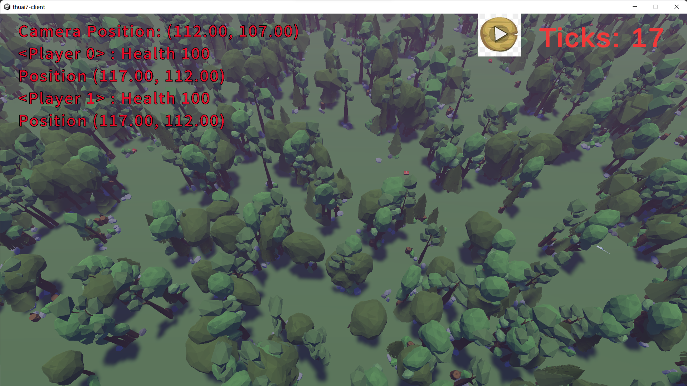

# 比赛规则

## 比赛流程

每场比赛均由**两支队伍**展开激烈对战，即场上仅存在两个无人作战系统。

1. 比赛开始前  
    地图上会随机分布各种[资源](../supplies)，包括武器、弹药、护甲、药品和手榴弹。选手们需要在比赛开始前的准备时刻通过代码预先设定好起始位置，以便在比赛开始时迅速进入战斗状态。
2. 比赛过程中  
    比赛开始后，选手们需要通过智能算法控制无人作战系统在地图上移动，寻找并收集这些资源，以提升自身的战斗力。同时，选手们可以对其他队伍的无人作战系统发起攻击，争夺优势。  
    地图上会有一个不断缩小的[安全区](#安全区)，安全区外的区域会受到网络病毒的影响。选手在安全区外每秒会受到伤害，因此需要时刻注意安全区的变化，避免被病毒侵蚀。同时，安全区的缩小也会迫使选手们逐渐靠近，增加战斗的频率和激烈程度。
3. 结束条件  
    比赛持续到只剩下最后一个无人作战系统存活，该系统所属的队伍即为胜利者。如果在规定的时间内，所有队伍的无人作战系统都已全部被淘汰，那么存活时间最长的队伍将获胜。

## 细节规则

### 帧数

比赛以每秒 20 ticks（即 20 次更新）的速度进行。

### 地图

大小为 256m×256m 的平面，由 256×256 个边长为 1m 的方格构成，每个方格的中心位置可表示为 $(a + 0.5, b + 0.5)$，$a$，$b$ 为整数。地图上随机分布有墙体和资源。墙体能抵挡部分攻击，为玩家提供庇护；资源不会刷新，可供选手收集以增强自身实力。选手需巧妙利用地形与资源，展开激烈的较量。

地图上弥漫着网络病毒，安全区会不断缩小。选手在安全区外每秒会受到伤害，因此需要时刻注意安全区的变化，避免被病毒侵蚀。

### 墙体

由棱长为 1m 的正方体组成，可以抵挡部分攻击，墙体**不可被破坏**。

上图展示了地图中墙体的示意图，这些墙体是根据一定的规则生成的，其形状固定而位置随机。

:::info

这些墙体的生成是通过特定的代码实现的，你可以[点击链接](https://github.com/thuasta/thuai-7/blob/main/server/src/GameServer/GameLogic/Map/Map.Buildings.cs)查看生成墙体的代码。

:::

### 安全区

安全区是一个初始半径为 256m 的圆形区域，其面积会随着时间的推移逐渐减小，5min 后消失。安全区的圆心会随机移动，选手需要时刻关注安全区的位置，以避免受到网络病毒的伤害。在安全区外，选手每秒会受到 20 点真实伤害（每 tick 受到 1 点伤害），因此必须尽快进入安全区。以下是安全区示意图，红色粒子效果内较明亮区域为安全区。

### 选手

无人作战系统具有以下属性：

- 物理实体：直径 1 米的圆柱体。

  :::note

  仅限于受击判定。移动时视为**质点**。

  :::

- 生命值：150 点，生命值耗尽后无人作战系统被淘汰。

- 速度：每秒 5 米。

- 出生点选择：游戏开始的前 200 ticks 内为准备时间，游戏逻辑不会更新，选手攻击、移动、拾取等操作均不生效。选手此时可以根据地图信息在地图范围内选择一个出生点，之后无法更改。若出生点不合法（例如在墙体上）或选手没有选择，则会被系统随机分配一个合法的出生点。

  :::warning

  在前 200 ticks 中，选手**无法获得地图上的其他选手的位置信息**（得到的位置总是为(0, 0)）。

  :::

- 移动：选手给出目的地坐标后，沿直线前进；运动过程中若碰到墙体，则仅保留平行于墙体的速度分量。

  :::note

  正常情况下坐标计算误差不超过 $10^{-3}$ 。

  :::
  
- 背包容量：170 个单位空间，用于存放收集到的资源。

- 拾取：选手可以拾取 **当前脚下 1×1 方格上** 的资源，若背包容量充足，资源会直接放入背包，拾取后资源消失。

  :::tip[如何得到当前脚下是哪一块方格？]

  选手可以通过 SDK 获取自己当前的位置，然后将其向下取整即可得到当前脚下方格的坐标。
  
  :::

- 攻击：
  - 无武器时拳击，CD 为 1 游戏刻，伤害为 38 生命值。
  - 可拾取至多两把**不同类型**的武器（例如当无人作战系统已拾取 `AWM`，则不能再拾取地图上的其他 `AWM`）。

  :::tip

  选手应避免目标位置和无人作战系统自身位置重合，否则无人作战系统将因无法辨认目标方位而浪费子弹。

  :::

- 视野：无人作战系统可以获取地图上的所有信息，包括其他选手的位置、状态和资源分布。

  :::info

  可获取已掷出的手雷大致位置，因此无人作战系统需要自主判断地图上可能存在的手雷。

  :::

- 无人作战系统所有操作都是按请求结算，即无人作战系统每发起一次请求都会**立即**结算。一帧内可以进行任意多次操作。

## 选手代码实现要求

### 总述

选手需要写出一个完整的程序（Agent），能够完成下列基本操作，并根据战场形势决定最优策略。选手的所有逻辑包括条件判断、动态的检测与决策等）都必须在代码中完成，一旦开始对战就无法通过任何形式（如命令行）改变逻辑或手动输入命令。选手最终提交一个或多个文件（若选择使用[接口](#接口调用说明)，则为相应的 `.cpp`  或 `.py` 文件），其中必须包括所有的代码。

### 接口调用说明

选手的代码需要通过预定义的 API 与比赛服务器进行交互，请查看 [C++ SDK 文档](../cpp_sdk) 或 [Python SDK 文档](../python_sdk)。

基本操作：选择出生地；移动 / 停止；拾取 / 丢弃资源；攻击；使用药品；使用手榴弹；获取战场信息。

## 赛制说明

- 初赛赛制：循环赛制，任意两个智能体之间对战 4 次。
- 决赛赛制：循环赛制，任意两个智能体之间对战 4 次。
- 娱乐赛：初赛后，决赛前，设立娱乐赛，选手可以自由上传代码进行对战。
