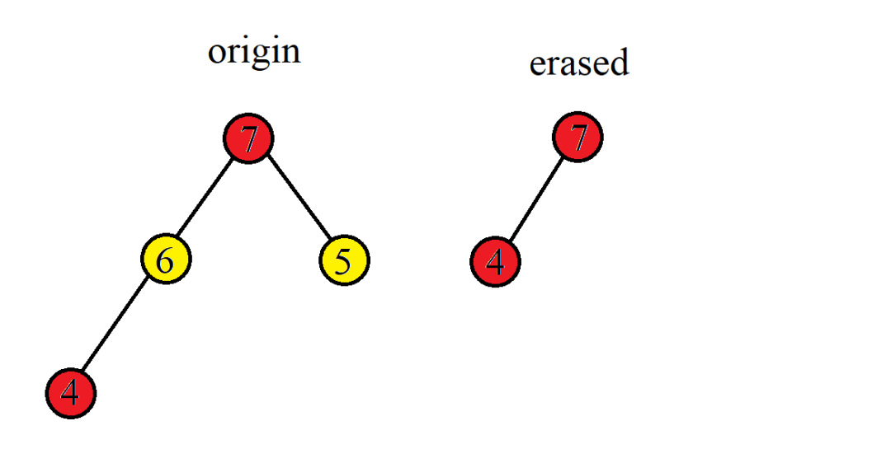
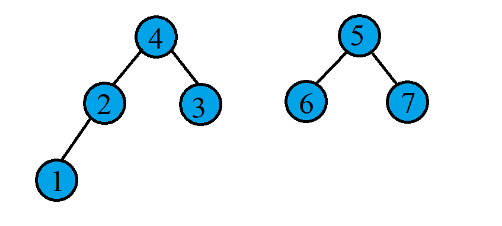

# 两个堆可以做什么？

# ——堆的任意删除与变化集合的中位数

:::note

[阅读原文](https://mp.weixin.qq.com/s/xxEHc5B350YfcUNlG86JjA)

:::

在数据结构课上，我们学习了**堆**这一有用的数据结构，它支持 $O(log n)$ 插入元素，$O(1)$ 访问最值与 $O(log n)$ 删除最值，并可用于实现优先队列。下面我们将看到，将两个同向（均为大根堆或小根堆）或对顶（分别为大根堆与小根堆）的堆拼接使用，可以简洁地支持强大的功能。

## 同向堆：堆的任意删除

一个堆虽然可以用于维护最值，但不方便之处在于删除只能对堆顶元素进行。若将两个同向的堆拼接起来，则可使得这一功能更加完整，实现对于任意指定元素的删除操作。

在删除操作没有到来时，我们仍然像平常一样维护一个堆，用于存放需要维护的元素；当删除操作到来时，我们实行“懒惰删除”的想法——无论堆里存在多少本该删除的元素，只要它不是堆顶，就不会影响我们对堆的访问；只有在待删除元素成为堆顶，即将被当作真正要使用的值的时候，我们才真的将它删掉。这样，我们就解决了堆本来不提供任意删除接口的问题。

新的问题是，如何判断一个元素是否本应该被删掉？很自然地，我们需要维护一个应该被删掉但还没有被删掉的元素的集合，并在每次需要使用堆顶元素时，检查堆顶元素是否在这个集合里。我们还可以发现一个很好的性质：如果堆顶元素在这个集合里，它一定是这个集合的最大值（以维护的是大根堆为例，下同）；否则，这个集合的最大值比堆里的最大值更大，它不可能存在于现在的堆中，矛盾。

这样，我们就可以用另一个大根堆来维护这一集合，每次需要删除时，将所删元素加入这个堆；每次需要访问原堆的最值时，不断检查其是否与这个堆的堆顶相同，若相同，则同时弹出两个堆的堆顶。



下进行时间复杂度分析：

- **插入操作**：与原来相比没有改变，时间复杂度为 $O(log n)$。
- **删除操作**：若完整地完成，每一个元素需要进入待删堆、出待删堆、出原堆三个过程，尽管这三个过程不是同时发生的，但总时间复杂度仍为 $O(log n)$。
- **访问最值操作**：虽然可能在此时会有实质的删除，但若将删除过程的代价放在前一步分析，只考虑对最值的访问的话，仍然是 $O(1)$ 的。
- **删除最值操作**：仍为 $O(log n)$。

以下是相关函数的 C++ 代码示意：

```cpp
std::priority_queue<int> origin, erased;

void erase(int x) {
    erased.push(x);
}

void insert(int x) {
    origin.push(x);
}

void check_top() {
    while (!erased.empty() && origin.top() == erased.top()) {
        origin.pop();
        erased.pop();
    }
}

int top() {
    check_top();
    return origin.top();
}

void pop() {
    check_top();
    origin.pop();
}
```

## 对顶堆：变化集合的中位数

将对顶的两个堆拼接起来，又有什么作用呢？我们知道，小根堆里的数都不比小根堆堆顶小，而大根堆里的数都不比大根堆堆顶大。那么，要是我们使得小根堆的堆顶不小于大根堆的堆顶，就可以使得小根堆里的数都不小于大根堆里的数；要是我们再使得小根堆与大根堆的大小至多相差 1（特别地，我们限制大根堆大小不小于小根堆），大根堆的堆顶（或在不同定义下，两堆堆顶的平均数）即为两堆元素总的中位数。



于是，可以想见，我们可以实现 $O(log n)$ 插入元素并 $O(1)$ 访问中位数。访问操作是自然的。对于插入，我们先将元素插入两个堆中较小的堆，若大小相等则插入大根堆，以维护堆大小的限制；这时，堆顶的顺序可能会受到破坏，此时，我们取得并删除两个堆的堆顶，并分别插入另一个堆，由于原本的有序性，可以证明，此操作以后可满足堆顶顺序。以下是插入操作的 C++ 示例代码：

```cpp
std::priority_queue<int> top_biggest;
std::priority_queue<int, std::vector<int>, std::greater<int>> top_smallest;

void push(int x) {
    if (top_biggest.size() > top_smallest.size()) {
        top_smallest.push(x);
    } else {
        top_biggest.push(x);
    }
    if (!top_smallest.empty() && top_biggest.top() > top_smallest.top()) {
        int top_b = top_biggest.top(), top_s = top_smallest.top();
        top_biggest.pop();
        top_smallest.pop();
        top_biggest.push(top_s);
        top_smallest.push(top_b);
    }
}
```

此外，这一方法不只适用于中位数。对于求第 $k$ 大数，且 $k$ 每次的变化量为 $O(1)$ 的情形，对顶堆的方法也是容易使用的。

对顶堆维护中位数是否可以支持删除？联合上述两种方法，或许可以。然而，这对于堆这样轻量级的数据结构而言，显得过于复杂了。我们可以看到，本文所述的两种拓展，都可以使用平衡树来代替（即使会损失查询的复杂度）；与其进行更复杂的拓展，可能选择采取平衡树等更通用的数据结构，会是更好的手段。

:::tip[习题推荐]

- 数据结构课作业 最大曼哈顿距离
- [洛谷 P1168 中位数](https://www.luogu.com.cn/problem/P1168)
- [洛谷 P1801 黑匣子](https://www.luogu.com.cn/problem/P1801)

:::
