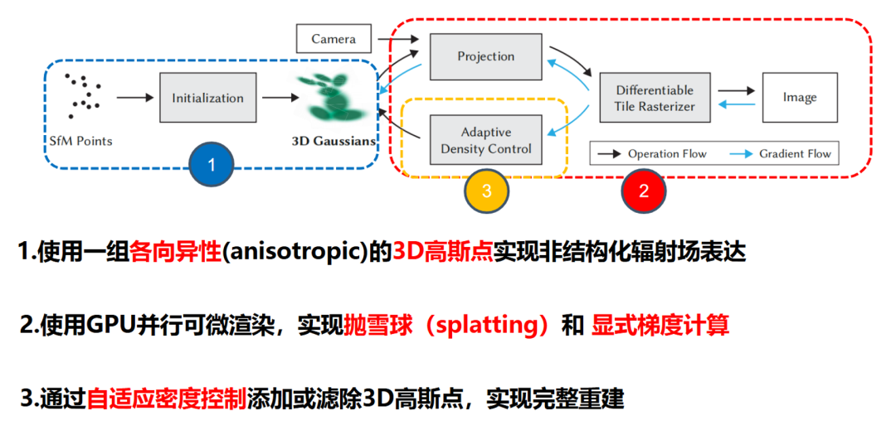
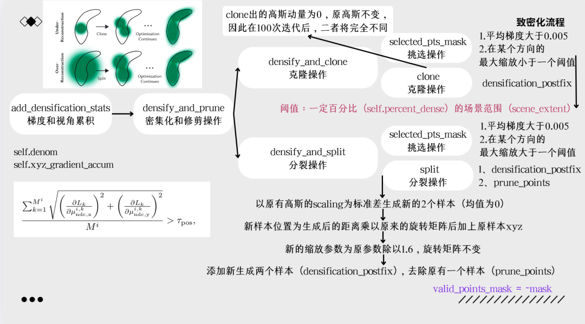
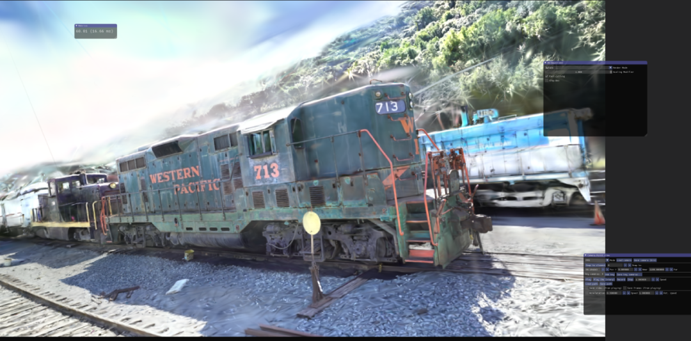

# 经典论文 3D Gaussian Splatting 解读及实验进行

:::note

[阅读原文](https://mp.weixin.qq.com/s/YcBs25ClmepZQB5aphJYzA)

:::

## 引言

场景三维重建技术经历了从离线到实时、从被动到主动的不断演进。早期的三维重建依赖于静态图像和离线计算，主要通过立体视觉和结构光方法（如结构从运动 SfM）来从多个视角的静态图像中提取三维信息。这些方法通常计算量巨大，且需要在所有图像采集完成后才能进行处理，因此无法实现实时重建。MVS（多视角立体重建）是这一时期的代表技术，开源软件 [Colmap](https://github.com/colmap/colmap) 便是一个典型的解决方案。

随着技术的发展，三维重建逐步向实时环境过渡，目标是能够在实时估计相机运动轨迹的同时构建环境地图，用于定位和导航。这一进展主要通过 SLAM（同步定位与建图）技术实现，它可以达到每秒 30 帧以上的实时性能。

进入到主动时代，场景重建开始使用神经辐射场（NeRF）等光场方法，通过神经网络实现高质量的三维重建。NeRF 通过连续的场景表示并优化多层感知器（MLP）来捕捉场景的新视角。这类方法通常利用体素[Fridovich-Keil 和 Yu 等，2022]、哈希网格[Müller 等，2022]或点云[Xu 等，2022]等结构来存储连续场景表示，尽管这些方法能够优化渲染效果，但随机采样的过程非常昂贵，且容易导致噪声。

2023 年，3D 高斯作为一种新的场景表示方法被提出，提供了更高的灵活性和表现力。其与 NeRF 类似，采用 SfM（结构从运动）校准的相机，并基于 SfM 过程中产生的稀疏点云来初始化 3D 高斯集。与依赖于多视图立体匹配（MVS）数据的点云方法不同，其只需要使用 SfM 生成的稀疏点云，就能够获得高质量的三维重建结果。

其主要有三个关键部分：

1. **使用 3D 高斯作为表征**，因为它们不仅可以作为可微分的体积表示，还可以通过投影到二维并应用标准的 𝛼 混合方法实现高效的光栅化，与 NeRF 使用的图像生成模型类似。
2. **对 3D 高斯属性的优化**。通过与自适应密度控制的步骤交错进行，在优化过程中会动态地添加和移除 3D 高斯点，从而产生一个相对紧凑、非结构化且精确的场景表示。对于所有测试场景，最终的高斯点数量一般在 1 百万至 5 百万之间。
3. **提出了一种实时渲染解决方案**。该方案采用了一种快速的 GPU 排序算法，并遵循了最近的研究[例如 Lassner 和 Zollhofer，2021]。得益于 3D 高斯表示，我们能够进行各向异性的 splatting，通过可见性排序、排序和 𝛼 混合技术，实现高效且精确的反向传播。

## 核心理论

3D 高斯函数沿某一轴进行积分后等同于 2D 高斯函数，这是由于高斯函数的一些性质决定的。

1. **高斯函数是可以分离的**，即多维高斯函数可以表示为各个维度上的一维高斯函数的乘积。这意味着，多维高斯函数沿某一维度进行积分，就相当于将这一维度的一维高斯函数积分到 1，剩下的就是其他维度的高斯函数，即一个低一维的高斯函数。
2. **高斯函数的边缘分布也是高斯的**。多维高斯函数的边缘分布就是将某一维度积掉，得到的结果仍然是高斯的。这再次证明了 3D 高斯函数沿某一轴进行积分后等同于 2D 高斯函数。

这个性质在图形学中有很重要的应用，例如在 3D Gaussian Splatting 中，将 3D 高斯投影到投影平面后得到的 2D 图形称为 “**Splat**”，然后通过计算待求解像素和椭圆中心的距离，可以得到不透明度。由于 3D 高斯的轴向积分等同于 2D 高斯，可以用 2D 高斯直接替换积分过程，从数学层面摆脱了采样量的限制，计算量由高斯数量决定，而高斯又可以使用光栅化管线快速并行渲染。



以上是代码最核心的 pipeline，首先将点云输入转化为一组 3DGS 点的表述，之后通过 GPU 进行并行渲染，并进行显示梯度计算（其将梯度计算的过程写为 CUDA 代码进行显示的前向后向推导，将每一步都进行单独的计算，而不是自动求导来进行优化），最后通过自适应的密度控制来完成重建，而具体的训练流程如下图所示：



其主要通过梯度累计，去将梯度过大并且缩放过小的高斯球进行克隆，将梯度过大并且缩放过大的高斯球进行分裂。通过自适应的密度控制来进行 3DGS 数量的控制。

## 环境配置

3DGS 的环境配置较为复杂。

### 前置工作

1. Colmap下载

    下载 release 版本即可。

    - [Colmap](https://github.com/colmap/colmap)
    - [Colmap 3.8](https://github.com/colmap/colmap/releases/tag/3.8)

2. Visual Studio 2019 下载

    :::warning

    注意不要下载 2022，可能会报错。

    :::

    安装后在 installer 中安装 C++ 相关内容。

3. CUDA 安装

    :::warning

    仅适用有显卡的机器。

    :::

   - 进入 [CUDA Toolkit Archive](https://developer.nvidia.com/cuda-toolkit-archive)，选择 CUDA11.8（几乎是最适配版本，官方给出 11.6，但有些问题），之后按照系统安装即可（在 VS2019 安装后再安装 CUDA）。
   - 安装结束后，打开终端键入：

   ```bash
   nvcc --version
   ```

   - 显示如下，即为成功。（此处为安装的是 CUDA11.3）

   

### anaconda 安装与配置

1. 使用 git clone 自动下载源码，终端输入：

    ```bash
    git clone https://github.com/graphdeco-inria/gaussian-splatting.git --recursive
    ```

2. 下载完成后检查 `gaussian-splatting/submodules/` 中是否有 `diff-gaussian-rasterization`，并检查其下是否为空；检查 `diff-gaussian-rasterization/third_party/glm` 中是否有内容。同样检查 `submodules/simple-knn`。如果没有内容，可通过以下链接手动下载并解压到相应位置：

   - 下载 [diff-gaussian-rasterization](https://github.com/graphdeco-inria/diff-gaussian-rasterization/tree/59f5f77e3ddbac3ed9db93ec2cfe99ed6c5d121d)
   - 下载 [diff-gaussian-rasterization/third_party/glm](https://github.com/g-truc/glm/tree/5c46b9c07008ae65cb81ab79cd677ecc1934b903)
   - 下载 [submodules/simple-knnsimple-knn](https://gitlab.inria.fr/bkerbl/simple-knn)

3. 在 anaconda 中新建环境 `gaussian_splatting`，按照下述命令安装：

    ```bash
    # 安装 pytorch
    pip3 install torch torchvision torchaudio --index-url https://download.pytorch.org/whl/cu118
    pip install plyfile tqdm
    pip install diff-gaussian-rasterization
    pip install submodules/simple-knn
    ```

4. 安装可视化软件（Windows 系统，确保在 `gaussian-splatting` 目录下，且安装了 [cmake](../../../learning_resources/build_sys/cmake.md)）：

    ```bash
    cd SIBR_viewers
    cmake -Bbuild .
    cmake --build build --target install --config RelWithDebInfo
    ```

## 实验与结果

实验数据一半如下组织：

```plaintext
<location>
|---images
|   |---<image 0>
|   |---<image 1>
|   |---...
|---sparse
    |---0
        |---cameras.bin
        |---images.bin
        |---points3D.bin
```

- `sparse/0/` 为 colmap 稀疏重建的结果。

之后运行：

```bash
python train.py -s --eval # Train with train/test split
python render.py -m # Generate renderings
python metrics.py -m # Compute error metrics on renderings
```

即可得到训练后的结果，并且得到渲染后的图片与评估的结果。

训练后可以用这个命令查看：

```bash
./<SIBR install dir>/bin/SIBR_gaussianViewer_app -m <path to trained model>
```

也可以进入 `gaussian-splatting/viewers/bin` 文件夹后用以下命令来运行：

```bash
./SIBR_gaussianViewer_app.exe -m <path to trained model>
```

以下为我个人的样例训练结果：


